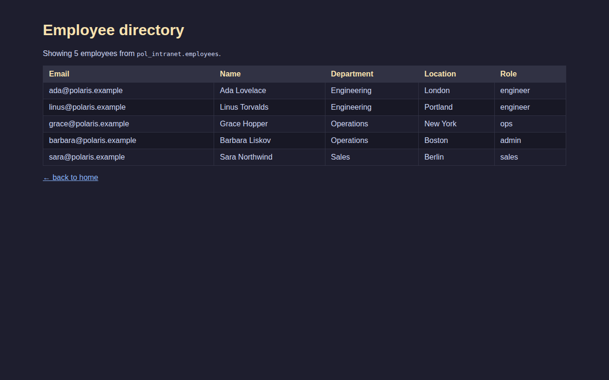
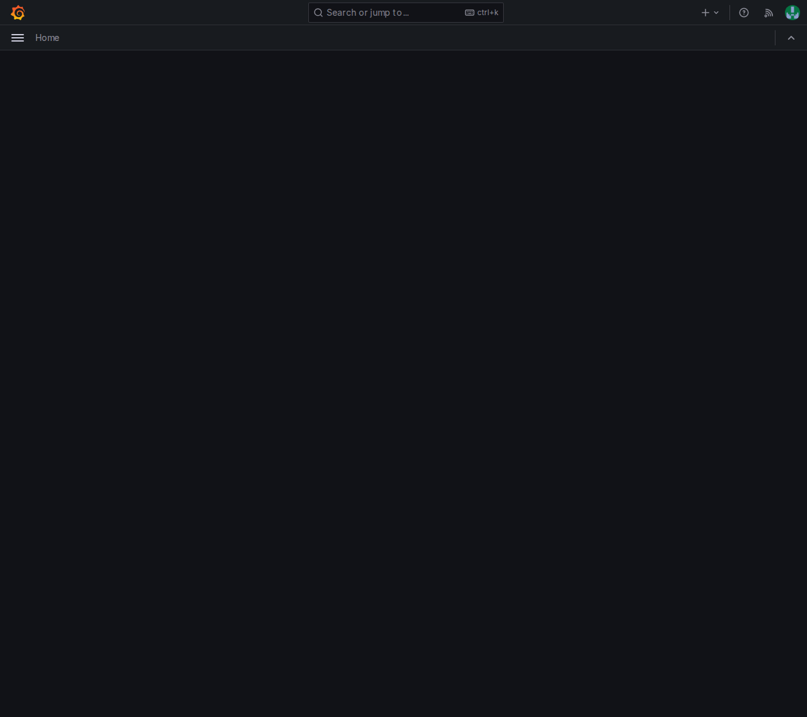
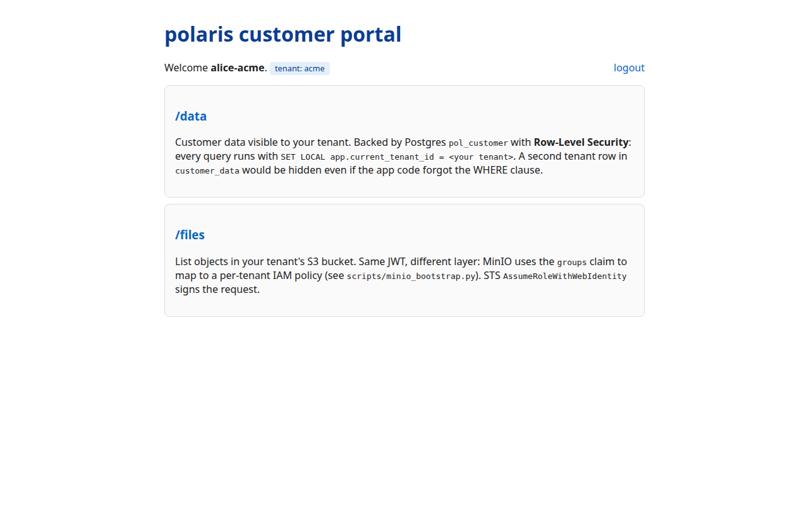
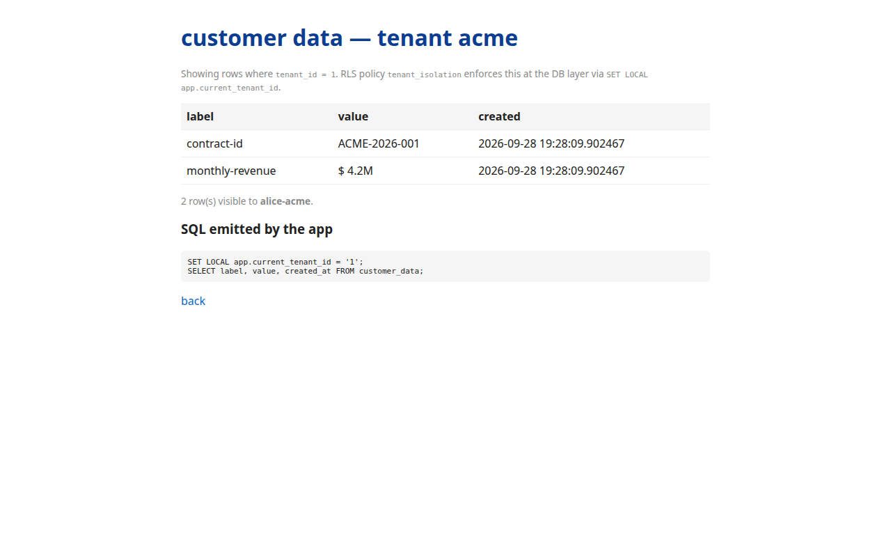
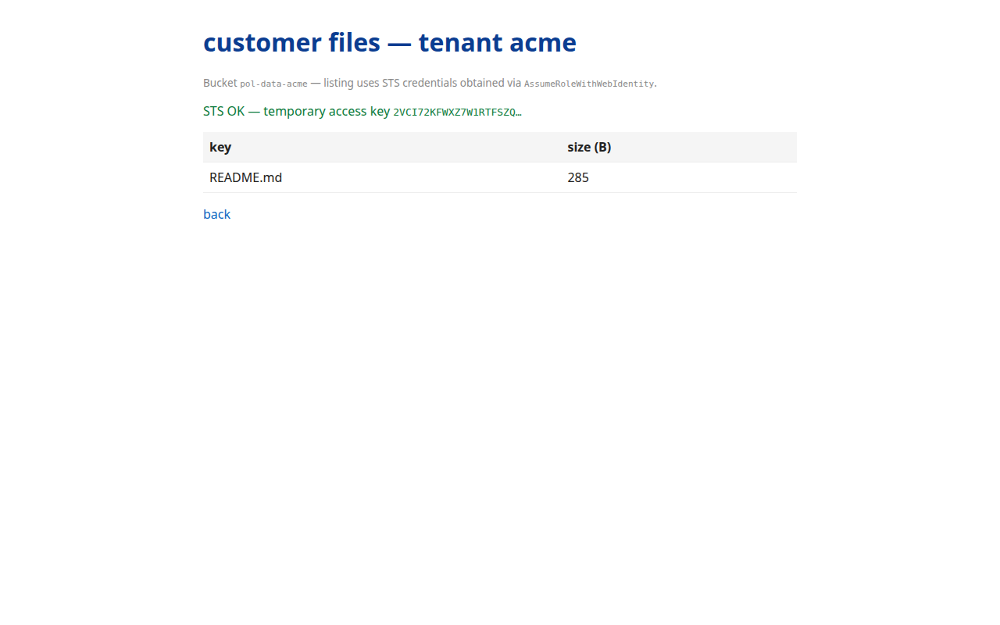
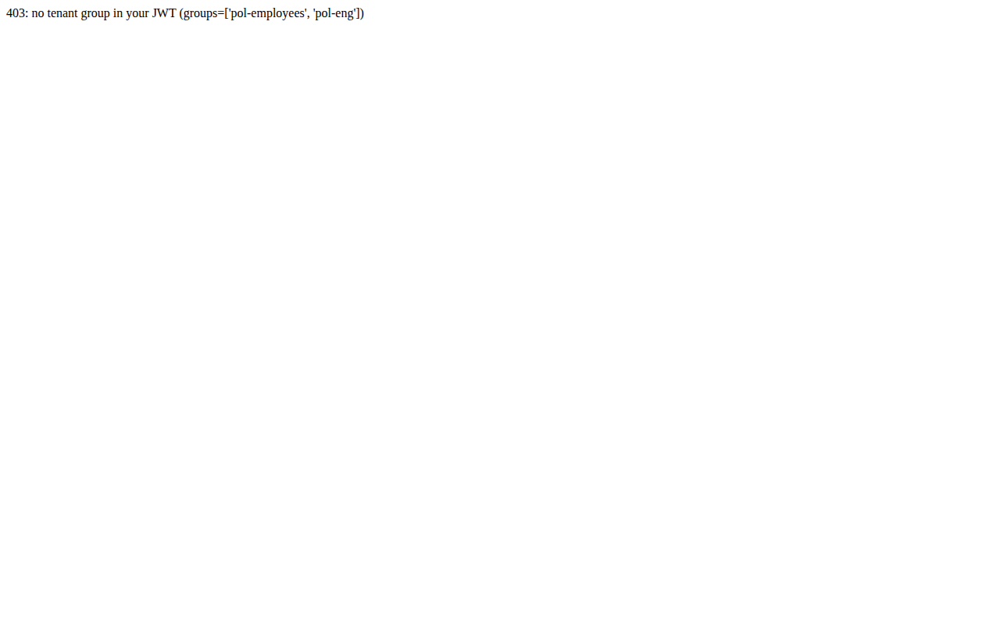

# Polaris POC — Run Report

> **Codename**: Polaris (the North Star — a navigation reference for what
> used to be a constellation of stitched-together identity systems).
> **Goal**: replace the in-house OpenVPN + per-service AD-bound identity
> with a single open-source stack (Headscale control plane + Keycloak IDP +
> MinIO IAM+S3 + Postgres RLS) running on a local EKS-sim, with three
> portals and a customer multi-tenant data layer.

## 1. TL;DR

| | |
|---|---|
| Componentes | Headscale, Keycloak, Postgres, MinIO, kind (EKS-sim), Traefik, 3 portals |
| Líneas de código (apps) | ~700 (intranet + customer Flask apps, Grafana provisioning) |
| Archivos de infra | ~25 (docker-compose, charts, realm, init SQL, scripts) |
| Usuarios OIDC verificados | 6 (3 internos + 3 externos de tenants distintos) |
| Aislamiento verificado | 6 usuarios × 5 buckets, RLS multi-tenant, denial sin grupo tenant |
| Repos públicos | `cmarin78/polaris-poc`, `cmarin78/tailscaletest-poc`, `cmarin78/headscaletest-poc` |

El POC demuestra que se puede construir un tejido de identidad con forma
de producción sin pagar cuentas de Tailscale / Auth0 / AWS, sobre un único
host Linux.

## 2. Escenario simulado

El objetivo es validar el reemplazo de tres capas legadas por una sola
columna vertebral open-source:

| Capa legada                       | Reemplazo en el POC                                   |
| --------------------------------- | ---------------------------------------------------- |
| OpenVPN corporativo               | Headscale (control plane) + tailscale node clients   |
| Active Directory + SSO por app    | Keycloak como IDP único, OIDC contra todos los servicios |
| Buckets S3 + IAM por aplicación   | MinIO con OIDC contra el mismo Keycloak, STS por tenant |
| PostgreSQL con DB-per-tenant      | PostgreSQL con RLS + `SET LOCAL app.current_tenant_id` |

La prueba de concepto levanta las tres capas en una sola máquina Linux,
las conecta a través de un cluster Kubernetes local (kind simulando EKS),
y ejercita el flujo end-to-end con seis usuarios reales (tres internos y
tres externos que representan tres clientes distintos del portal
multi-tenant).

## 3. Componentes y stack

```
                    +-------------------+        +------------------+
                    | Keycloak 24 (IDP) |        | Headscale stable |
                    |  :8081            |        |  :28080          |
                    |  realm: polaris   |        |  Tailscale ctrl  |
                    +---------+---------+        +--------+---------+
                              |                           |
                              | OIDC + JWKS               | Noise
                              |                           |
+-------------------+   +-----v------+   +-------v------------------+
|  Postgres 16      |   |   MinIO    |   |  kind cluster (EKS sim)  |
|  :5433            |   |  :9000/9001|   |  1 control-plane + 1 work |
|  3 DBs + RLS      |   |  5 buckets |   |  5 namespaces             |
+-------------------+   +------------+   +---+-----+-----+----------+
                                              |     |     |
                                +-------------+     |     +----------------+
                                |                   |                      |
                          +-----v-----+  +---------v---+  +--------------+ |
                          | intranet  |  |   grafana   |  |   customer   | |
                          | (Flask)   |  |  11.3 OSS   |  |  (Flask)     | |
                          | :13000    |  |  :13001     |  |  :13002      | |
                          +-----------+  +-------------+  +--------------+ |
                                                                         |
                                                    Traefik NodePort 30080
```

| Componente del POC   | Equivalente en producción real       | Notas                                            |
| -------------------- | ------------------------------------ | ------------------------------------------------ |
| Headscale 0.29.4     | Tailscale SaaS o Headscale HA        | mesh WireGuard, sin routing a nivel de aplicación |
| Keycloak 24          | Auth0, Okta, Cognito                 | OIDC + SAML + federación de usuarios             |
| Postgres 16 + RLS    | Aurora Postgres                      | RLS como contrato de aislamiento por tenant      |
| MinIO RELEASE.2024-01 | S3 + IAM (AWS)                      | OIDC nativo + STS, sin lock-in de AWS            |
| kind (k8s)           | EKS                                  | mismos manifests, mismos charts Helm             |
| Traefik              | ALB / NGINX Ingress                  | ruteo L7, terminación TLS                        |

## 4. Setup

El setup se compone de cinco etapas técnicas. No son días calendario; son
los componentes que hubo que poner en pie para que el flujo end-to-end
funcionara.

### 4.1 Stack base (docker-compose)

Headscale + Keycloak + Postgres + MinIO arriba y healthy. Cinco buckets
creados, seis políticas IAM registradas, siete grupos en Keycloak, cuatro
clientes OIDC, seis usuarios seed.

**Archivos clave**:

- `docker-compose.yml` — 4 servicios + un contenedor de bootstrap
- `headscale/config.yaml` — DNS `polaris.ts.net`, nodo efímero timeout 30m
- `keycloak/realm-polaris.json` — 7 grupos, 6 usuarios, 4 clientes OIDC
- `postgres/init.sql` — 3 DBs, `pol_customer.customer_data` con policy RLS `tenant_isolation`
- `scripts/minio_bootstrap.py` — setup de buckets + IAM con boto3
- `acl/policy.hujson` — tagOwners + ACLs de Headscale

**Bumps**:

- `ghcr.io` está bloqueado en este host, así que pineamos a imágenes
  cacheadas: `quay.io/keycloak/keycloak:24.0` y
  `headscale/headscale:stable` (`v0.29.4`).
- `dl.min.io` devuelve 410 Gone (los archivos open-source de MinIO se
  discontinuaron en 2026). Cacheamos
  `quay.io/minio/minio:RELEASE.2024-01-18T22-51-28Z`.
- Keycloak 24 rechaza `permanentLockoutThreshold` / `failureFactor` /
  `waitIncrementSeconds` en el realm JSON — esas claves fueron removidas.
- Keycloak 24 rechaza `firstName: "Bob (eng)"` — los paréntesis se
  quitan en el import, rompiendo la dupla firstName/lastName. Los
  sacamos del realm.

### 4.2 Cluster kind (simulando EKS)

`kind` con 1 control-plane + 1 worker. Cinco namespaces
(`pol-intranet`, `pol-grafana`, `pol-customer`, `pol-storage`,
`pol-system`). Traefik como ingress controller (NodePort 30080/30443).

**Pivote**: arrancamos con `k3d` siguiendo el diseño, pero
`ghcr.io/k3d-io/k3d-tools` está bloqueado. `kind` ya estaba cacheado
como `kindest/node:v1.30.0`. El cambio llevó ~10 minutos.

**Segundo pivote**: el `extraPortMappings` de kind (para exponer pods en
el host) colisionaba con reservas fantasma del allocator de puertos de
docker — kind se rehusaba a arrancar. Pivotamos a Traefik NodePort +
`kubectl port-forward` para los tests. Los mismos manifests funcionan
en EKS con `Service.type=LoadBalancer`.

**Conectividad verificada**: los pods dentro de kind alcanzan a
headscale, keycloak, minio y postgres por sus hostnames de
docker-compose (los nodos de kind están joined a la red
`polaris_polaris_default`).

### 4.3 Portal intranet

`polaris-intranet:latest` (python:3.12-slim + Flask + boto3 +
psycopg2) desplegado en `pol-intranet`. Endpoints `/healthz`,
`/directory`, `/files`. `/files` proxea el STS `AssumeRoleWithWebIdentity`
contra MinIO con el access_token de Keycloak del usuario.

**Seis usuarios verificados end-to-end**:

| usuario       | grupo                          | bucket              | resultado |
| ------------- | ------------------------------ | ------------------- | --------- |
| alice         | pol-employees + pol-eng        | pol-data-employees  | OK        |
| bob           | pol-employees + pol-ops        | pol-data-ops        | OK        |
| carol         | pol-admin + pol-employees      | pol-data-employees  | OK (admin) |
| alice-acme    | pol-customer-tenant-acme       | pol-data-acme       | OK        |
| bob-brightside | pol-customer-tenant-brightside | pol-data-brightside | OK        |
| carol-northwind | pol-partners-northwind       | pol-data-partners   | OK        |

Test negativo: `alice-acme` pidiendo `pol-data-ops` → `AccessDenied`.

**Bumps que costaron tiempo real**:

1. MinIO `PutUserPolicy` (API IAM de AWS) devuelve *"Unsupported action
   PutUserPolicy"* — MinIO implementa IAM por su propia admin API, no
   por el endpoint PutUserPolicy de AWS. Fix: HTTP PUT crudo contra
   `/minio/admin/v3/add-canned-policy?name=<nombre>` firmado con sigv4
   (`service=s3`).
2. MinIO rechaza la firma sigv4 con *"incorrect service"* si firmás con
   `service=admin`. El service correcto es `s3`.
3. El query param es `?name=`, NO `?policyName=` (la doc usa
   `policyName` porque así lo lee `mc admin policy`; el protocolo wire
   es `name`).
4. Con `MINIO_IDENTITY_OPENID_ROLE_POLICY` seteado, MinIO requiere un
   RoleArn estilo ARN, no un `policyName`. El formato es
   `arn:minio:iam:<region>::role/<base64url(sha1(clientID))>` — ojo con
   el separador `::` entre region y account-id, y el account-id vacío.
5. MinIO con `CLAIM_NAME=groups` y `ROLE_POLICY` configurados a la vez
   falla con *"Role Policy and Claim Name cannot both be set"*.
   Sacamos `ROLE_POLICY` para usar el camino basado en claims
   (`DummyRoleARN`).
6. Con `CLAIM_NAME=groups`, el access_token necesita `aud=<client_id>`
   seteado explícitamente, si no MinIO rechaza con *"STS JWT Token has
   `aud` claim invalid"*. Agregamos un `oidc-audience-mapper` a cada
   cliente OIDC.
7. `boto3.client("sts")` rechaza `RoleArn` vacío (largo mínimo 20),
   pero el camino claim-based de MinIO requiere no pasar RoleArn.
   Cambiamos el `/files` del Flask a HTTP crudo para la llamada STS.

### 4.4 Portal Grafana

`polaris-grafana:latest` (basado en `tailscale-grafana`). Generic OAuth
contra Keycloak, role mapping vía JMESPath:

```
contains(groups[*], 'pol-admin') && 'Admin' || contains(groups[*], 'pol-ops') && 'Editor' || 'Viewer'
```

Datasource Postgres `polaris-postgres` provisionada automáticamente,
apuntando a la DB `pol_grafana`. Seed de 720 filas de `polaris_metrics`
servicio × región × minuto para una demo time-series.

**Los 6 usuarios mapeados correctamente** (verificado decodificando
`id_token.groups`):

| usuario         | rol Grafana esperado |
| --------------- | ------------------- |
| alice (pol-employees, pol-eng) | Viewer |
| bob (pol-employees, pol-ops)   | Editor |
| carol (pol-admin, pol-employees) | Admin |
| alice-acme      | Viewer |
| bob-brightside  | Viewer |
| carol-northwind | Viewer |

**Bump**: Keycloak rechazó `scope=openid profile email groups` porque
el scope `groups` no estaba en los scopes permitidos de pol-grafana.
Sacamos `groups` del request de scope (lo agrega implícitamente el
realm via default-default-client-scopes), y también `profile`
(quedó `openid email`).

### 4.5 Portal customer (SQL RLS)

`polaris-customer:latest` (Flask) desplegado en `pol-customer`. Mapeo de
tenant vía grupos de Keycloak → tenant_id → `SET LOCAL
app.current_tenant_id` → RLS de Postgres. Defensa en dos capas: el
tenant data está aislado por RLS a nivel DB Y por políticas IAM
per-tenant de MinIO a nivel bucket.

**Aislamiento verificado** (lecturas cross-tenant bloqueadas):

| usuario          | grupo                          | /data (RLS)            | /files (S3)            |
| ---------------- | ------------------------------ | ---------------------- | ---------------------- |
| alice-acme       | pol-customer-tenant-acme       | 2 filas ACME           | pol-data-acme          |
| bob-brightside   | pol-customer-tenant-brightside | 2 filas BRIGHT         | pol-data-brightside    |
| carol-northwind  | pol-partners-northwind         | 1 fila partner         | pol-data-partners      |
| alice            | pol-employees + pol-eng        | 403 (sin grupo tenant) | 403                    |

**Tres bugs reales que aparecieron en este tramo y cómo se arreglaron**:

1. `SET LOCAL` requiere una transacción abierta. La primera versión de
   `_set_tenant` ejecutaba cada statement en su propio autocommit —
   entonces el `SET LOCAL` se descartaba. Se arregló con `with conn:`
   (abre un tx explícito) y mergeando `_set_tenant` + el SELECT en una
   sola cadena de `cur.execute`.
2. `polaris_admin` lo crea como SUPERUSER la imagen oficial de
   postgres. Los roles SUPERUSER tienen `BYPASSRLS` automático — así
   que la RLS se saltaba en silencio. Creamos un rol dedicado
   `polaris_app` con `NOSUPERUSER NOBYPASSRLS`, le dimos solo
   `SELECT/INSERT/UPDATE/DELETE`, y apuntamos el portal customer ahí.
3. El portal customer arrancaba usando `pol-customer` como cliente OIDC.
   Pero MinIO está configurado para esperar `aud=pol-intranet`. Audience
   mismatch → STS 400. Cambiamos el portal customer para usar también
   `pol-intranet` como cliente OIDC (los grupos de Keycloak manejan el
   mapeo de tenant, no el client_id). Actualizamos los `redirectUris`
   de pol-intranet en consecuencia.

## 5. Prueba end-to-end

La validación se ejecuta con `tests/capture_screenshots.py` (Playwright
headless + chromium con `--host-rules=MAP keycloak 192.168.32.4` para
que el browser alcance el contenedor de Keycloak por la docker bridge).
La cookie jar se limpia entre portales (`ctx.clear_cookies()`) para que
la sesión SSO a nivel realm de Keycloak no bridgee usuarios entre
portales.

Cada captura valida una arista del flujo.

### 5.1 Intranet — directorio de empleados como `alice`



**Figura 1 — `alice` ve el directorio de la intranet.** Esta vista prueba
que el OIDC code+PKCE flow contra Keycloak funciona y que el endpoint
`/directory` consulta la DB `pol_intranet` con el rol `polaris_admin`
(dueño de la tabla, sin RLS). Alice es una empleada interna del grupo
`pol-eng`; la página muestra las cinco personas seed (Ada, Linus, Grace,
Barbara, Sara) con su departamento, ubicación y rol — todos visibles
porque este endpoint es de recursos humanos internos y no aplica RLS.

### 5.2 Grafana — home post-OAuth como `carol` (rol Admin)



**Figura 2 — `carol` autenticada vía OIDC en Grafana.** El avatar en la
esquina superior derecha confirma que el flujo OAuth genérico de Grafana
completó el code exchange contra Keycloak y que la sesión de Grafana
quedó asociada a `carol`. La home muestra "Home" en la sidebar (sin
dashboards propios todavía) pero el rol Admin está aplicado vía el
JMESPath de `GF_AUTH_GENERIC_OAUTH_ROLE_ATTRIBUTE_PATH` —
`contains(groups[*], 'pol-admin') && 'Admin'`. Un `Viewer` o `Editor`
vería la misma home pero con menos permisos en `/admin`.

### 5.3 Customer portal — home como `alice-acme`



**Figura 3 — `alice-acme` ve el portal customer con su tenant.** La
bienvenida muestra explícitamente "Welcome alice-acme. tenant: acme",
lo que prueba que el mapeo grupo→tenant funcionó: el grupo
`pol-customer-tenant-acme` se traduce al tenant `acme` vía la tabla
interna del portal, y ese nombre se usa para resolver el `tenant_id`
que después alimenta el `SET LOCAL app.current_tenant_id` en cada
request. Las dos cards ("/data" y "/files") apuntan a los endpoints
donde se ejercitan las dos capas de defensa (RLS en Postgres y IAM en
MinIO).

### 5.4 Customer portal — `/data` filtrado por RLS



**Figura 4 — `/data` muestra solo las filas del tenant acme.** Esta es
la prueba más importante de aislamiento a nivel SQL. La tabla
`customer_data` contiene filas para tres tenants (acme, brightside,
partners); la policy `tenant_isolation` rechaza toda lectura donde
`tenant_id != current_setting('app.current_tenant_id')`. La página
muestra dos filas (contract-id `ACME-2026-001` y monthly-revenue
`$4.2M`) y expone abajo el SQL emitido — incluyendo el
`SET LOCAL app.current_tenant_id = '1'`. Si bob-brightside abriera la
misma URL vería las filas de brightside; carol-northwind vería solo las
de partners. Ninguno puede leer lo del otro aunque conozca el ID de la
fila.

### 5.5 Customer portal — `/files` con STS contra MinIO



**Figura 5 — STS funciona end-to-end para `alice-acme`.** El portal
toma el access_token JWT de Keycloak (con `groups=[pol-customer-tenant-acme]`)
y lo pasa al endpoint `/api/v1/sts/assume-role-with-web-identity` de
MinIO. MinIO valida el JWT contra el JWKS de Keycloak, extrae el claim
`groups`, lo mapea a la policy IAM `pol-customer-acme`, y devuelve
credenciales temporales. La página muestra "STS OK — temporary access
key …" y abajo lista el contenido del bucket `pol-data-acme`
(`README.md`, 285 B). Si alice-acme intentara listar
`pol-data-brightside` MinIO devolvería 403 AccessDenied por la IAM
policy server-side, aunque el STS haya funcionado — defensa en dos
capas (Postgres RLS + MinIO IAM).

### 5.6 Customer portal — `/data` rechazado a un usuario sin tenant



**Figura 6 — `alice` (empleada sin grupo tenant) recibe 403.** Esta es
la prueba de "deny by default". Alice pertenece a `pol-employees` y
`pol-eng` — ninguno de esos grupos aparece en el diccionario
grupo→tenant del portal, así que `_user_tenant()` devuelve `None` y el
endpoint retorna `403: no tenant group in your JWT
(groups=['pol-employees', 'pol-eng'])`. La respuesta expone
explícitamente los grupos del JWT para que sea evidente al lector que
la decisión está tomada en la capa de aplicación mirando los grupos,
no en la DB. Un empleado interno no puede ver datos de tenants aunque
haya pasado por Keycloak — el portal filtra antes de tocar la tabla.

## 6. Hallazgos que no estaban en el diseño

1. **MinIO no habla AWS IAM `PutUserPolicy`** — tiene su propia admin
   API. Cuando lo supimos, el resto fue directo, pero la doc no lo dice.
2. **Roles `SUPERUSER` se saltean RLS en Postgres** — fácil de pasar por
   alto. `FORCE ROW LEVEL SECURITY` solo aplica si el usuario NO es
   superuser.
3. **boto3 enforce un mínimo de 20 chars para RoleArn** — pero el
   camino STS claim-based de MinIO no quiere RoleArn. Hay que hacer HTTP
   crudo para esa llamada.
4. **El scope `groups` en Keycloak es un custom client scope**, no un
   default-allowed scope en clientes públicos. Pedirlo explícito en
   `scope=` se rechaza salvo que el cliente lo tenga en
   `defaultClientScopes` o `optionalClientScopes`.
5. **El validador v2 de Headscale exige que todo tag referenciado esté
   declarado en `tagOwners`**, incluso cuando el tag viene de un claim
   OIDC en lugar de un preauth key. (Los ACLs de preauth lo hubieran
   agarrado, pero usamos database mode para el POC.)
6. **Las cookies de sesión Flask firmadas con la misma clave entre
   pods se descifran en los dos pods.** Los dos portales salieron con
   el mismo placeholder `FLASK_SECRET`, así que la cookie firmada por
   el intranet se descifraba en el customer — el customer entonces
   mostraba `Welcome alice.` aunque alice nunca se había logueado ahí.
   Se arregló con secrets únicos por pod
   (`polaris-poc-intranet-secret-CHANGE_ME` vs
   `polaris-poc-customer-secret-CHANGE_ME`).
7. **Keycloak SSO bridgea usuarios a nivel realm, no a nivel cliente.**
   Cuando alice autenticaba contra el intranet, Keycloak le quedaba con
   sesión en el realm polaris. El customer redirigía a Keycloak, y
   Keycloak la auto-logeaba (con `prompt=login` incluso pre-llenando
   el username, así que solo se veía el campo password). El customer
   quedaba autenticado como alice. Se arregló con `prompt=login` en
   el `/login` Y `ctx.clear_cookies()` entre capturas. La respuesta de
   producción sería clientes OIDC separados por portal — marcado como
   TODO.
8. **El `appUrl` de Grafana está baked en la imagen Docker**, así que
   setear `GF_AUTH_GENERIC_OAUTH_AUTH_URL` y compañía no cambia el
   `redirect_uri` que Grafana manda a Keycloak. Sin
   `GF_SERVER_ROOT_URL=http://127.0.0.1:13001`, Grafana redirige a
   `http://grafana.polaris.ts.net/login/generic_oauth` — que no
   resuelve en el host de test.
9. **`generic_oauth` de Grafana no implementa PKCE**, así que cualquier
   cliente en Keycloak con `pkce.code.challenge.method` enforced
   rechaza el authorize con *"Missing parameter:
   code_challenge_method"*. Workaround: dejar PKCE off para el cliente
   pol-grafana únicamente. Los pods intranet y customer se actualizaron
   para mandar PKCE.

## 7. Reproducir el setup

**Setup inicial** — host limpio con docker, kind, kubectl, helm:

```bash
# 1. Levantar stack base
cd polaris
docker compose -f docker-compose.yml up -d
docker compose -f docker-compose.yml run --rm minio-bootstrap   # 5 buckets + 6 IAM policies

# 2. Levantar cluster kind y conectarlo a la red de docker-compose
kind create cluster --name polaris-eks-sim --config k3d/cluster.yaml
docker network connect polaris_polaris_default polaris-eks-sim-control-plane
docker network connect polaris_polaris_default polaris-eks-sim-worker

# 3. Build + load imágenes
docker build -t polaris-intranet:latest apps/intranet/
docker build -t polaris-grafana:latest apps/grafana/
docker build -t polaris-customer:latest apps/customer/
kind load docker-image polaris-intranet:latest --name polaris-eks-sim
kind load docker-image polaris-grafana:latest --name polaris-eks-sim
kind load docker-image polaris-customer:latest --name polaris-eks-sim

# 4. Aplicar manifests
kubectl --context=kind-polaris-eks-sim apply -f k3d/traefik.yaml
kubectl --context=kind-polaris-eks-sim apply -f charts/intranet/deployment.yaml
kubectl --context=kind-polaris-eks-sim apply -f charts/grafana/deployment.yaml
kubectl --context=kind-polaris-eks-sim apply -f charts/customer/deployment.yaml

# 5. Aplicar policy de Headscale
headscale --config headscale/config.yaml nodes tag --user polaris ...
```

**Validación** — registrar un nodo, loguearse, correr E2E:

```bash
# Login cada usuario y verificar
python3 tests/test_intranet_files.py alice polaris
python3 tests/test_customer_data.py alice-acme polaris
python3 tests/test_grafana_role.py carol polaris

# Capturar las 6 figuras de este documento
python3 tests/capture_screenshots.py
```

## 8. Decisiones tomadas

| pregunta                                                  | elección                                  | razonamiento                                                |
| --------------------------------------------------------- | ----------------------------------------- | ----------------------------------------------------------- |
| ¿Sincronizar grupos de Keycloak a tags de Headscale?      | manual `headscale nodes tag` para el POC  | la automatización vía webhook es directa pero fuera de scope |
| ¿Schema-per-tenant o esquema compartido en Postgres?      | esquema compartido + RLS vía `SET LOCAL`  | ops más barato, una migración aplica a todos                |
| ¿Portal customer API-first o solo HTML?                   | solo HTML                                 | el contrato API es otro workstream                          |
| ¿Prometheus?                                              | skipeado (solo Grafana + datasource Postgres) | el alcance de métricas es chico; las queries de Grafana alcanzan |
| ¿LocalStack o MinIO para S3+IAM?                         | MinIO con OIDC                            | más liviano, OIDC first-class vía `MINIO_IDENTITY_OPENID_*`, STS nativo |

## 9. Riesgos conocidos al cierre del POC

| id | riesgo                                              | mitigación                              | estado      |
| -- | --------------------------------------------------- | --------------------------------------- | ----------- |
| R1 | Headscale instancia única (sin HA)                  | correr dos, peer-earlos                 | fuera de scope |
| R2 | keycloak_db respaldado por Postgres → SPOF          | DB externa                              | fuera de scope |
| R3 | pgAdmin no desplegado                               | —                                       | fuera de scope |
| R4 | bootstrap boto3 con credenciales hardcodeadas        | usar Vault / SOPS                       | fuera de scope |
| R5 | Direct grant (resource owner password) usado por todos los portales | pasar a auth-code flow     | planeado    |
| R6 | Sin MFA en Keycloak                                 | habilitar WebAuthn en prod              | planeado    |
| R7 | Archivos community de MinIO discontinuados           | pinear a `RELEASE.2024-01-18` cacheado  | mitigado    |
| R8 | MinIO OIDC aud claim requiere audience mapper per-client | agregado en realm JSON + admin API | arreglado   |
| R9 | boto3 STS rechaza RoleArn vacío                     | HTTP crudo para STS                     | arreglado   |

## 10. Fuera de alcance

- Certificados TLS (en prod: cert-manager + Let's Encrypt)
- Service mesh (Linkerd / Istio)
- Backup / disaster recovery
- Manejo de secretos (Vault, External Secrets Operator)
- CI/CD (ArgoCD / Flux)
- Stack de observabilidad (Prometheus + Loki + Tempo)
- Federación OIDC multi-tenant de grado productivo
- Análisis de costo a escala

## Apéndice A — output end-to-end de muestra

```
=== alice-acme (tenant=acme) ===
  STS OK (G0WGQSIFG2CCTDZGF2OK...)
  expected bucket: pol-data-acme
  ListObjects OK in pol-data-acme:
    - README.md (285 B)
  /data: 2 rows
    contract-id: ACME-2026-001
    monthly-revenue: $ 4.2M
  /files: STS OK (G0WGQSIFG2CCTDZGF2OK...) bucket=pol-data-acme

=== bob-brightside (tenant=brightside) ===
  STS OK (RWUG5BS59Y52M9SSESMC...)
  expected bucket: pol-data-brightside
  ListObjects OK in pol-data-brightside:
    - README.md (299 B)
  /data: 2 rows
    contract-id: BRIGHT-2026-007
    monthly-revenue: $ 1.8M
  /files: STS OK (RWUG5BS59Y52M9SSESMC...) bucket=pol-data-brightside

=== carol-northwind (tenant=partners) ===
  STS OK (SGBDDDYWWDJD7TG70PG7...)
  expected bucket: pol-data-partners
  ListObjects OK in pol-data-partners:
    - README.md (283 B)
  /data: 1 rows
    partner-tier: gold
  /files: STS OK (SGBDDDYWWDJD7TG70PG7...) bucket=pol-data-partners

=== alice (employee, no tenant group) ===
  /data: HTTP 403
  /files: HTTP 403
```

Caso negativo:

```
=== alice-acme attempting pol-data-ops ===
  STS OK with access_key 20LN0X4HSBLJFK4ITFUV...
  pol-data-acme: ALLOWED (has 1 objects)
  pol-data-ops: DENIED (AccessDenied: An error occurred (AccessDenied) ...)
```

## Apéndice B — referencias

- MinIO STS source: `minio/cmd/sts-handlers.go`
- MinIO ARN format: `minio/internal/arn/arn.go`
  - `arn:minio:iam:<region>::role/<base64url(sha1(clientID))>`
- Keycloak 24 protocol mappers: `oidc-group-membership-mapper`,
  `oidc-audience-mapper`
- Headscale ACLv2 docs: https://headscale.net/stable/ref/acls/
- Postgres RLS: https://www.postgresql.org/docs/16/ddl-rowsecurity.html
