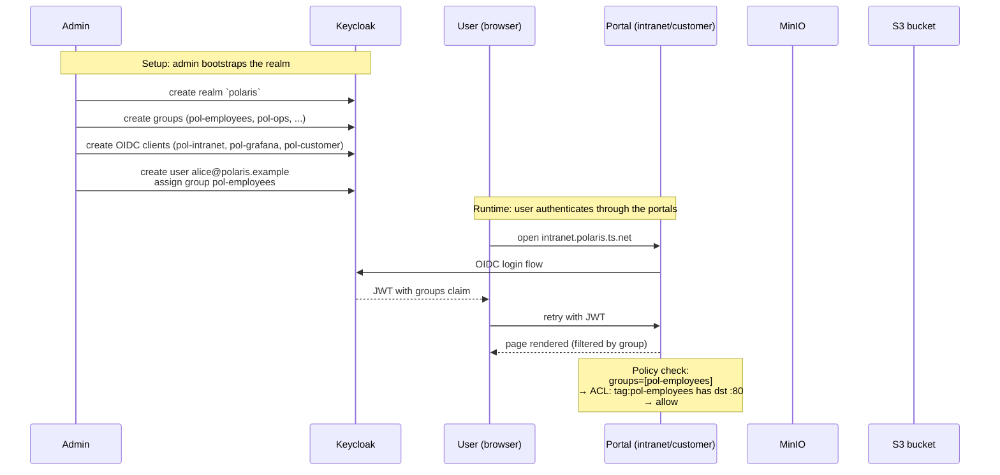
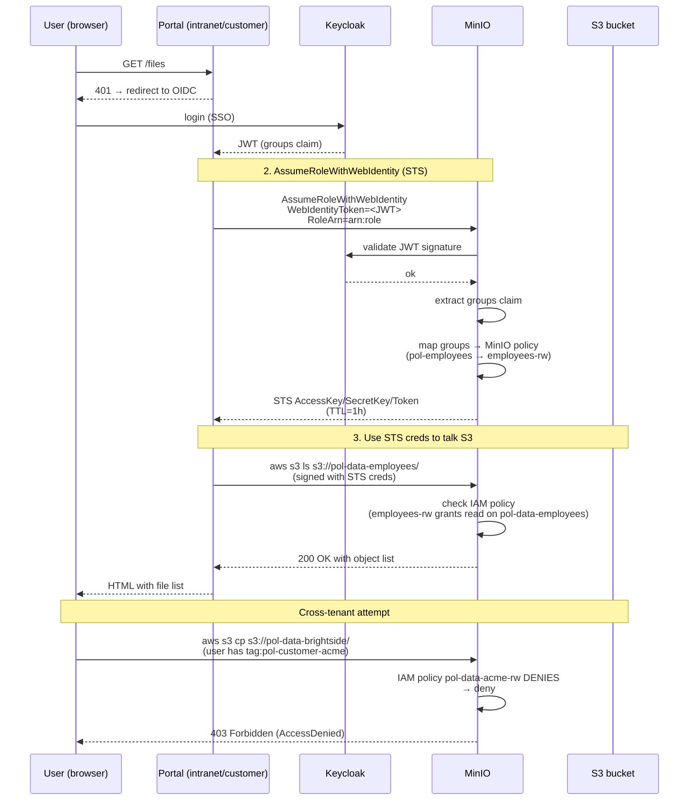

# Polaris POC — Topology, Architecture, and Policy Reference

This document describes what the POC simulates, how the components are
wired together, how the tailnet (Tailscale mesh) and the Headscale
access-control policy work in this setup, and what each of the six
captured screenshots proves.

## 1. Motivations, objectives, and needs

### What the POC is replacing

| Current production reality (the "legacy" stack we want to retire) | Replacement the POC validates                                          |
| ----------------------------------------------------------------- | --------------------------------------------------------------------- |
| Site-to-site OpenVPN                                               | WireGuard mesh via Tailscale clients, control plane in Headscale      |
| Per-app Active Directory SSO with NTLM/Kerberos dance              | One Keycloak realm, OIDC issued once, every portal speaks OIDC        |
| Per-application S3 + per-app IAM roles, separate AWS accounts      | One MinIO instance, OIDC-direct STS, IAM policy mapped from Keycloak groups |
| DB-per-tenant Postgres (one database per customer)                 | Shared schema + RLS via `SET LOCAL app.current_tenant_id`            |
| Manual "this employee can see this app" spreadsheets               | Tag-driven ACLs in Headscale + Keycloak `groups` claim driving IAM    |

### Why these specific tools

| Tool          | Why                                                                                         |
| ------------- | ------------------------------------------------------------------------------------------- |
| Headscale     | Full ownership of the Tailscale control plane. No SaaS dependency for the network mesh.    |
| Keycloak 24   | OSS OIDC + SAML + user federation. The same identity backplane the SaaS vendors charge for. |
| MinIO         | S3-compatible, OIDC first-class via `MINIO_IDENTITY_OPENID_*`, no AWS lock-in.            |
| Postgres 16 + RLS | Cheaper ops than DB-per-tenant. One migration applies to all customers.                |
| kind (k8s)    | Same manifests and Helm charts as EKS. No infra-drift between POC and prod.                |
| Traefik       | L7 ingress in the cluster; same role as ALB / NGINX Ingress in prod.                       |

### Objectives the POC needs to demonstrate

1. **One identity fabric, three portals.** Alice, Bob, Carol (employees)
   and `alice-acme`, `bob-brightside`, `carol-northwind` (one external
   customer per tenant) can each log in to the relevant portal with no
   per-app credentials.
2. **Tag-driven network access.** A user can only reach the pod whose
   tag their Keycloak group maps to. The Headscale ACL is the only
   source of truth for "may user X talk to tag Y on port Z".
3. **Tenant data isolation.** A customer user can only see rows and
   objects of their own tenant. Postgres RLS and MinIO IAM each enforce
   this independently — neither can be bypassed by the other failing.
4. **Deny by default.** A user without the right group gets 403, not
   "no rows" or "empty bucket" — the portal reads the JWT groups and
   refuses to even attempt the query.
5. **Reproducible from a clean host.** `make bootstrap && make deploy`
   brings the whole thing up.

## 2. Network topology

```mermaid
flowchart TB
    subgraph Internet["Internet / external network"]
        User["User's browser<br/>+ tailscale client"]
    end

    subgraph Host["Host (single Linux machine)"]
        direction TB

        Proxy["Traefik ingress<br/>:8080 / :30443"]

        subgraph Kind["kind cluster: polaris-eks-sim"]
            direction TB

            subgraph NS1["ns: pol-intranet"]
                Intranet["intranet pod<br/>Flask :3000<br/>tag:pol-intranet"]
            end

            subgraph NS2["ns: pol-grafana"]
                Grafana["grafana pod<br/>:3000<br/>tag:pol-grafana"]
            end

            subgraph NS3["ns: pol-customer"]
                Customer["customer pod<br/>Flask :3000<br/>tag:pol-customer-{tenant}"]
            end

            subgraph NS4["ns: pol-storage"]
                MinIO["MinIO pod<br/>S3 :9000 / console :9001<br/>tag:pol-minio"]
            end
        end

        Headscale["Headscale<br/>control plane<br/>:28080"]
        Keycloak["Keycloak<br/>:8081<br/>realm: polaris"]
        Postgres["Postgres<br/>:5433<br/>pol_intranet<br/>pol_grafana<br/>pol_customer"]
    end

    User -->|HTTPS<br/>intranet.polaris.ts.net| Proxy
    User -->|HTTPS<br/>grafana.polaris.ts.net|   Proxy
    User -->|HTTPS<br/>customer.polaris.ts.net|  Proxy
    Proxy --> Intranet
    Proxy --> Grafana
    Proxy --> Customer

    Intranet -.OIDC.-> Keycloak
    Grafana   -.OIDC.-> Keycloak
    Customer  -.OIDC.-> Keycloak

    Intranet --> Postgres
    Grafana   --> Postgres
    Customer  --> Postgres

    Intranet -.WireGuard.-> Headscale
    Grafana   -.WireGuard.-> Headscale
    Customer  -.WireGuard.-> Headscale
    MinIO     -.WireGuard.-> Headscale

    Intranet -.STS.-> MinIO
    Customer -.STS.-> MinIO
    MinIO    -.OIDC validate.-> Keycloak
```

Every pod joins the same tailnet through Headscale. The MagicDNS
suffix `polaris.ts.net` resolves any pod by its tag; e.g. the
intranet pod is reachable from any other node as
`intranet.polaris.ts.net`. The portals are also reachable via the
Traefik ingress from the host browser.

## 3. How the tailnet works

A "tailnet" is the mesh of Tailscale nodes that share a coordination
server. In this POC, the coordination server is Headscale (open
source). Each pod runs the Tailscale client as a sidecar; the client
authenticates to Headscale via OIDC against Keycloak, receives a node
key, and exchanges WireGuard public keys with the other nodes through
Headscale. After that, the WireGuard tunnels are direct between nodes
(no relay server required for nodes on the same LAN).

Tag assignment is the lever Headscale uses to make policy decisions.
A node announces its tags at registration time; Headscale validates
that the user registering the node is in the `tagOwners` map for those
tags (otherwise the registration is rejected). After registration,
the node keeps those tags for its lifetime.

This POC uses ten tags:

| Tag                          | Who owns it  | Who gets it (the actual tag assignment)                     |
| ---------------------------- | ------------ | ---------------------------------------------------------- |
| `tag:pol-intranet`           | polaris      | the intranet portal pod                                    |
| `tag:pol-grafana`            | polaris      | the Grafana pod                                            |
| `tag:pol-customer-acme`      | polaris      | (reserved — pods only, not human users in this POC)        |
| `tag:pol-customer-brightside` | polaris      | (reserved)                                                 |
| `tag:pol-partners-northwind` | polaris      | (reserved)                                                 |
| `tag:pol-minio`              | polaris      | the MinIO pod                                              |
| `tag:pol-employees`          | polaris      | employee-side tailscale clients (Alice, Bob, Carol)        |
| `tag:pol-eng`                | polaris      | the engineer-tagged client (Alice)                         |
| `tag:pol-ops`                | polaris      | the ops-tagged client (Bob)                                |
| `tag:pol-admin`              | polaris      | the admin-tagged client (Carol)                            |

In the POC the portals' OIDC issuer is Keycloak, but the **pod**
registration uses a long-lived service principal (`user:polaris@`),
not a human login. That's why `tagOwners` lists only
`user:polaris@`: only the bootstrap identity can register a tagged
node. Human users (alice, bob, carol) authenticate to the
**portals**, not to the tailnet directly in the POC; their portal
session determines what data they see, and the tailnet is what lets
the portal pods reach MinIO and Postgres by MagicDNS name.

## 4. Headscale ACL policy explained

`acl/policy.hujson` is the single source of truth for "which tag can
talk to which tag on which port". The whole file is reproduced and
explained below.

```hujson
{
  "tagOwners": {
    "tag:pol-intranet":            ["user:polaris@"],
    "tag:pol-grafana":             ["user:polaris@"],
    "tag:pol-customer-acme":       ["user:polaris@"],
    "tag:pol-customer-brightside": ["user:polaris@"],
    "tag:pol-partners-northwind":  ["user:polaris@"],
    "tag:pol-minio":               ["user:polaris@"],
    "tag:pol-employees":           ["user:polaris@"],
    "tag:pol-eng":                 ["user:polaris@"],
    "tag:pol-ops":                 ["user:polaris@"],
    "tag:pol-admin":               ["user:polaris@"]
  },
```

`tagOwners` declares which user identity can register a node carrying
each tag. The `user:polaris@` literal is a Headscale-specific marker
(the trailing `@` is the validation token — without it Headscale
rejects the rule). The only principal that can register tagged nodes
is the bootstrap identity. In a real deployment this would be split:
each team would own its tags.

```hujson
  "acls": [
    // Employees can read the intranet and Grafana portals
    { "action": "accept",
      "src":    ["tag:pol-employees"],
      "dst":    ["tag:pol-intranet:80", "tag:pol-grafana:80"] },

    // Employees can talk to MinIO (the IAM layer decides which bucket)
    { "action": "accept",
      "src":    ["tag:pol-employees"],
      "dst":    ["tag:pol-minio:9000"] },

    // Ops has write access on Grafana and admin on MinIO
    { "action": "accept",
      "src":    ["tag:pol-ops"],
      "dst":    ["tag:pol-grafana:80", "tag:pol-minio:9000"] },

    // B2B customer Acme: only the Acme customer portal + MinIO
    { "action": "accept",
      "src":    ["tag:pol-customer-acme"],
      "dst":    ["tag:pol-intranet:80", "tag:pol-minio:9000"] },

    // B2B customer Brightside: only the Brightside customer portal + MinIO
    { "action": "accept",
      "src":    ["tag:pol-customer-brightside"],
      "dst":    ["tag:pol-intranet:80", "tag:pol-minio:9000"] },

    // Partner Northwind: only the Partners customer portal + MinIO (read-only via IAM)
    { "action": "accept",
      "src":    ["tag:pol-partners-northwind"],
      "dst":    ["tag:pol-intranet:80", "tag:pol-minio:9000"] },

    // Admin has access to everything (including the MinIO console :9001)
    {
      "action": "accept",
      "src":    ["tag:pol-admin"],
      "dst": [
        "tag:pol-intranet:80", "tag:pol-grafana:80",
        "tag:pol-customer-acme:80", "tag:pol-customer-brightside:80",
        "tag:pol-partners-northwind:80",
        "tag:pol-minio:9000", "tag:pol-minio:9001",
        "tag:pol-eng:22"
      ]
    },
    // The service sidecars (intranet, grafana, minio) reach MinIO via the
    // shared docker network in the POC, but the same rule applies if the
    // pods move to per-node tailnet routing later.
    {
      "action": "accept",
      "src":    ["tag:pol-intranet", "tag:pol-grafana", "tag:pol-minio"],
      "dst":    ["tag:pol-minio:9000"]
    }
  ],
```

The `acls` list is evaluated in order. The first matching rule wins.
There is no implicit deny (Headscale defaults to allow if no rule
matches), so the POC is permissive outside of these explicit rules.
A production deployment would add a closing `"action": "accept"`
to all `src: ["*"]` to make it permissive, or add an explicit
`"action": "accept"` with `src: ["autogroup:members"]` for an
explicit deny-by-default posture.

The customer groups (`tag:pol-customer-acme` etc.) deliberately only
have access to `tag:pol-intranet` (the customer-facing portal host).
In the POC the customer portal pod is reached at the same hostname
(`customer.polaris.ts.net`) for all three customer groups; the
portal itself reads the JWT to figure out which tenant the user
belongs to. A stricter deployment would have one portal per
customer group, each tagged differently, so the network layer also
enforces tenant boundaries.

```hujson
  "ssh": [
    // Ops can SSH to the bastion for k8s node debug (future); admin can too.
    {
      "action": "accept",
      "src":    ["tag:pol-ops", "tag:pol-admin"],
      "dst":    ["tag:pol-eng"],
      "users":  ["root"]
    }
  ]
}
```

The `ssh` section governs which tagged nodes accept SSH from which
other tagged nodes, and restricts the SSH login to a specific user
list (`users: ["root"]`). The POC exposes only one SSH rule:
ops- and admin-tagged clients can SSH as root into the bastion
(target tagged `tag:pol-eng`). Engineer-tagged clients cannot SSH
out in this POC because no rule lists them as a source.

## 5. Identity & access flow

The end-to-end login + IAM flow:



And the IAM layer (AssumeRoleWithWebIdentity):



## 6. Access matrix

The combined ACL × IAM × RLS view, for each user in the seed dataset:

| User             | Keycloak groups                                       | Tailscale tag (client) | Reaches in tailnet                   | Portal sees                                          | RLS sees in DB        | MinIO bucket policy applies |
| ---------------- | ----------------------------------------------------- | ---------------------- | ------------------------------------ | ---------------------------------------------------- | --------------------- | --------------------------- |
| alice            | pol-employees, pol-eng                                | tag:pol-employees, tag:pol-eng | intranet:80, grafana:80, minio:9000 | intranet home + directory, grafana (Viewer)          | — (employee, no tenant) → 403 | — (no `pol-customer-tenant-*` group) → 403 |
| bob              | pol-employees, pol-ops                                | tag:pol-employees, tag:pol-ops   | intranet:80, grafana:80, minio:9000 | intranet, grafana (Editor)                           | — → 403                | — → 403                     |
| carol            | pol-admin, pol-employees                              | tag:pol-admin, tag:pol-employees  | intranet:80, grafana:80, customer-{acme,brightside,partners}:80, minio:9000, minio:9001, eng:22 | intranet, grafana (Admin)                            | — → 403                | — → 403                     |
| alice-acme       | pol-customer-tenant-acme                              | tag:pol-customer-acme  | intranet:80, minio:9000              | customer home (`tenant: acme`), /data, /files        | 2 rows in `customer_data` WHERE tenant_id=acme | `pol-data-acme` allowed |
| bob-brightside   | pol-customer-tenant-brightside                        | tag:pol-customer-brightside | intranet:80, minio:9000        | customer home (`tenant: brightside`), /data, /files  | 2 rows in `customer_data` WHERE tenant_id=brightside | `pol-data-brightside` allowed |
| carol-northwind  | pol-partners-northwind                                | tag:pol-partners-northwind | intranet:80, minio:9000            | customer home (`tenant: partners`), /data, /files    | 1 row in `customer_data` WHERE tenant_id=partners | `pol-data-partners` allowed |

Tag-to-port mapping:

```mermaid
flowchart LR
    subgraph KC["Keycloak groups"]
        G1[pol-employees]
        G2[pol-eng]
        G3[pol-ops]
        G4[pol-admin]
        G5[pol-customer-tenant-acme]
        G6[pol-customer-tenant-brightside]
        G7[pol-partners-northwind]
    end

    subgraph TS["Tailscale tags (assigned to client)"]
        T1[tag:pol-employees]
        T2[tag:pol-eng]
        T3[tag:pol-ops]
        T4[tag:pol-admin]
        T5[tag:pol-customer-acme]
        T6[tag:pol-customer-brightside]
        T7[tag:pol-partners-northwind]
    end

    subgraph ACL["ACL destinations (this user can reach)"]
        A1[intranet:80]
        A2[grafana:80]
        A3[grafana:80 (write)]
        A4[bastion:22]
        A5[customer + DB acme]
        A6[customer + DB brightside]
        A7[customer + DB partners]
        A8[all destinations]
    end

    G1 --> T1 --> A1
    G1 --> T1 --> A2
    G2 --> T2 --> A1
    G2 --> T2 --> A4
    G3 --> T3 --> A2
    G3 --> T3 --> A3
    G3 --> T3 --> A4
    G4 --> T4 --> A8
    G5 --> T5 --> A5
    G6 --> T6 --> A6
    G7 --> T7 --> A7
```

## 7. Screenshots — what each one proves

These are the same six screenshots reproduced from
[`RUN_REPORT.md`](../RUN_REPORT.md) §5. They are listed here with
the architecture context so a reader can map a screenshot to the
specific component and flow it exercises.


**Figure 1 — Intranet directory as `alice`.** Exercises the
intranet pod (Flask + OIDC code+PKCE flow against Keycloak) +
Postgres `pol_intranet` read. The directory is an internal HR
resource, so it has no tenant group requirement and any
employee-tagged user can read it.


**Figure 2 — Grafana home as `carol`.** Exercises Grafana's
generic OAuth flow against Keycloak, the JMESPath-based role
mapping (`contains(groups[*], 'pol-admin') && 'Admin'`),
and the `polaris-postgres` datasource provisioning. The avatar
in the top right confirms that the session belongs to `carol`
under the Admin role.


**Figure 3 — Customer portal home as `alice-acme`.** Exercises the
customer pod's OIDC flow, the group→tenant resolution
(`pol-customer-tenant-acme` → tenant name `acme` → `tenant_id=1`),
and the `/data` + `/files` link rendering.


**Figure 4 — Customer `/data` shows only the acme tenant.** This is
the strongest single piece of evidence for tenant isolation at the
SQL layer. The page exposes the SQL it ran
(`SET LOCAL app.current_tenant_id = '1'; SELECT … FROM customer_data`),
so a reader can verify that the RLS policy `tenant_isolation` is the
mechanism that hid the brightside and partners rows. If
`bob-brightside` opens the same URL, he sees only the brightside rows.
If `alice` opens it (no `pol-customer-tenant-*` group), she gets a 403
before any SELECT runs.


**Figure 5 — Customer `/files` lists `pol-data-acme` via STS.** This
proves the second isolation layer (MinIO IAM). The customer pod
exchanges the user's Keycloak JWT at MinIO's
`/api/v1/sts/assume-role-with-webidentity` endpoint; MinIO validates
the JWT against Keycloak's JWKS, extracts the `groups` claim, maps
it to the IAM policy `pol-customer-acme`, and returns temporary
credentials. With those creds the pod calls `ListObjects` on
`pol-data-acme`. The same flow against `pol-data-brightside` would
be denied by the IAM policy even though the STS exchange itself
succeeds — defense in depth.


**Figure 6 — `alice` (no tenant group) is denied.** The customer
portal refuses the request at the application layer because the JWT
groups do not contain any `pol-customer-tenant-*` entry. The page
exposes the JWT groups for transparency: `['pol-employees', 'pol-eng']`.
This is the deny-by-default posture: an authenticated user without
the right group cannot see other tenants' data.

## 8. Two layers of authorization, both required

A cross-tenant leak requires both layers to fail:

| Layer        | What it controls                                       | Mechanism                                                            |
| ------------ | ------------------------------------------------------ | -------------------------------------------------------------------- |
| Network      | which user → which pod                                 | Headscale ACL v2 (`acl/policy.hujson`), tag-based                     |
| Identity     | which user → which app/portal                          | Keycloak `groups` claim in the OIDC id_token                         |
| Data (DB)    | which user → which row                                 | Postgres RLS via `SET LOCAL app.current_tenant_id`                   |
| Data (S3)    | which user → which bucket/object                       | MinIO IAM policy mapped from the JWT `groups` claim                  |

The customer group can reach `tag:pol-intranet:80` (network says
"yes"), and the JWT carries `pol-customer-tenant-acme` (identity
says "you're an acme customer"), and the SQL sees `tenant_id=acme`
(DB says "filter to acme"), and the STS creds allow `pol-data-acme`
(S3 says "you can read this bucket"). Removing any one of these
would either lock the user out or, in the case of a network bug,
still not leak cross-tenant data because RLS and IAM are
independent.

## 9. Constraints and known limitations

| Constraint                                                   | Impact                                                                |
| ------------------------------------------------------------ | --------------------------------------------------------------------- |
| `ghcr.io` is blocked on this host                            | use cached `quay.io/keycloak/keycloak:24.0`, `headscale/headscale:stable`, `kindest/node:v1.30.0` |
| `dl.min.io` returns 410 Gone                                 | pin to cached `quay.io/minio/minio:RELEASE.2024-01-18T22-51-28Z`     |
| `host.docker.internal` doesn't resolve on custom bridge nets  | kind nodes joined to `polaris_polaris_default` so docker hostnames resolve |
| Keycloak 24 doesn't accept `permanentLockoutThreshold` etc.  | those keys removed from the realm JSON                                 |
| Keycloak 24 strips parens from `firstName` on import         | parens removed from external users' firstNames                        |
| Headscale v2 requires every referenced tag declared          | all tags enumerated in `tagOwners`                                    |
| `mc` CLI image doesn't exist                                 | bootstrap MinIO via boto3 + raw HTTP (no `mc admin policy`)           |
| boto3 enforces `RoleArn` min length 20                       | STS calls go through raw HTTP                                          |
| `GF_SERVER_ROOT_URL` baked in Grafana image                  | set explicitly in the chart so the OAuth callback matches `127.0.0.1:13001` |
| Grafana's `generic_oauth` doesn't implement PKCE             | `pol-grafana` client has PKCE off; intranet and customer send PKCE    |
| Single OIDC client (`pol-intranet`) shared across portals    | mitigations: `prompt=login` + `FLASK_SECRET` unique per pod. Production should use one client per portal. |
